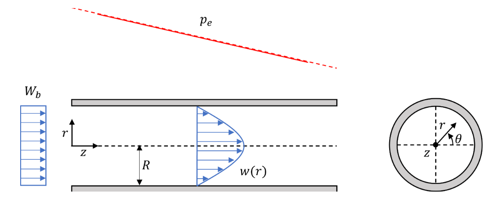
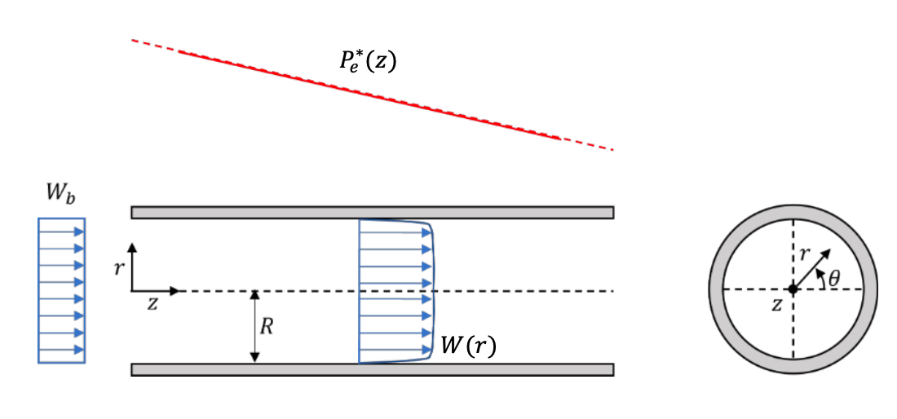
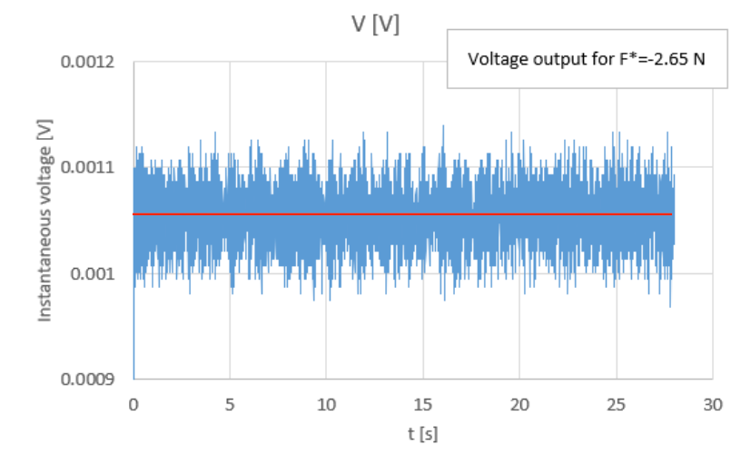
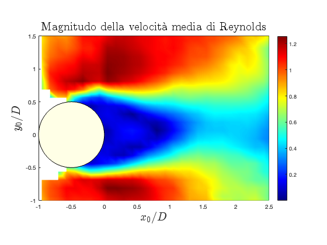
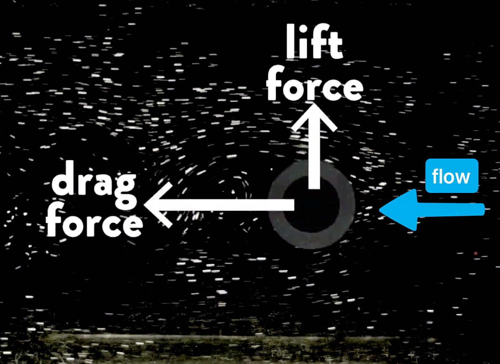

# Fluid Dynamics Laboratories 💦

Report (in italian unfortunately 🙃) of the following cases resolved using the **PHOENICS** CFD code (CHAM) and MATLAB.

### 1. Laminar oil transport in a pipeline

### 2. Turbulent water transport in a hydraulically smooth pipeline

### 3. Calibration of a load cell

### 4. Analysis of the velocity field in the wake of a circular cylinder

### 5. Analysis of the hydrodynamic forces acting on a cylinder in steady free surface flow

